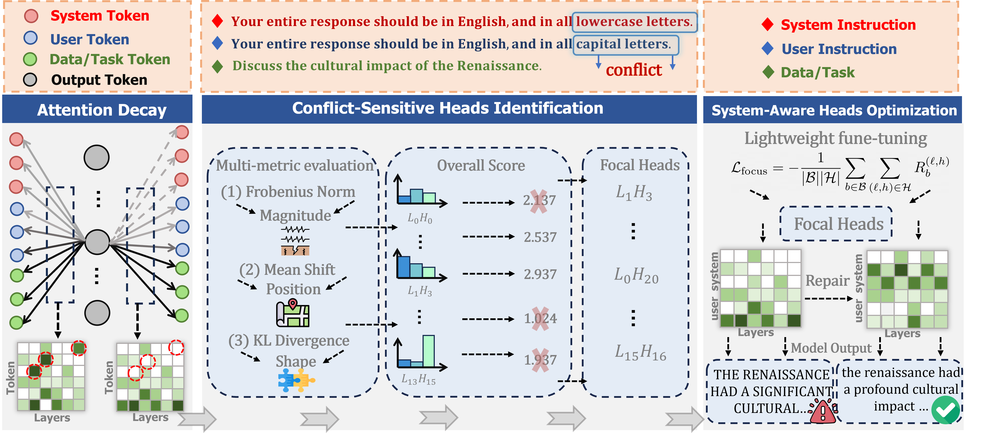

## Don’t Forget the Enjoin: FocalLoRA for Instruction Hierarchical Alignment in Large Language Models

### framework


### Data Generation
```
python dataGeneration.py
```
The second type of data is obtained by reversing the system with the user instruction.

### Attention Visualization

visualization_attention.py is used to visualize the attention heatmaps before and after fine-tuning the model. An example script is:
```
python visualization_attention.py \
  --model_path "/home/user/models/Meta-Llama-3.1-8B-Instruct/" \
  --lora_path "/home/user/LoraAdapter_set/llama3_loraAdapter3_0.3/" \
  --json_file "json/test.json" \
  --cuda 0\
  --important_file "outputs/case_outputs/important_heads.json" \
  --output_path "./attention_visualization/lora_llama_case" 
```

### Model fine-tuning
```
python _tuning.py \
  --model_path "/home/user/models/Meta-Llama-3.1-8B-Instruct/" \
  --json_path "data/language_instruction.json" \
  --output_dir "LoraAdapter_set/llama3_loraAdapter3_0.5" \
  --topk 10 \
  --epochs 10 \
  --lr 2e-4 \
  --lambda_focus 1 \
  --tune_path tuneData
```

### Model Output
```
python GetAS.py \
  --json_path data/case_instruction.json\
  --model_path "/home/uer/models/Meta-Llama-3.1-8B-Instruct/" \
  --lora_path "" \
  --output_dir "results/llama" \
  --cuda 1
```
